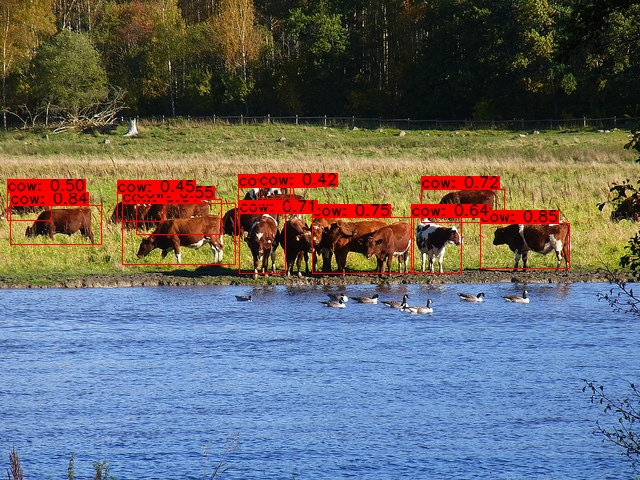

# PP_YOLO TensorFlow
### Tensorflow implementation of PP-YOLOv1

<p align="center" ></p>


## Requiremets Installation 

```bash
# Tensorflow CPU
conda env create -f conda-cpu.yml
conda activate yolov4-cpu

# Tensorflow GPU
conda env create -f conda-gpu.yml
conda activate yolov4-gpu
```

### Pip
```bash
# TensorFlow CPU
pip install -r requirements.txt

# TensorFlow GPU
pip install -r requirements-gpu.txt
```

## Custom Data Training 
### Step - 1 : (Setup "core/config.py file")
* Modify path of .names file (line 14)
* Modify number of classes (line 15)
* Modify path of train.txt file (line 30)
* Modify other parametrs like batch size, learning rate,etc according to your requirements (Optional)

Use following code to create train.txt file. First need to copy all annotations file and image to 'data/dataset' and then run following code.

```python
# create train.txt file
import glob

files = glob.glob('data/dataset/*.jpg')
with open('train.txt','w') as f:
  f.write('\n'.join(files))

```

### Step - 2 : (Model training)
Run following command for training
```bash
 python train.py
```
Note : If training interrupts due to any network or other issues , run following command for resuming. Use less learning rate to fix Nan error.
```bash
python train.py --const_lr True --resume 'checkpoints/pp_yolo'
```

### Step - 3: (Model covertion)
Run following command for model convertion , basically it's take saved weights and convert it to saved model format.

```bash
python convert.py --weights './checkpoints/pp_yolo' --save './saved_model' --size 416
```
### Step - 4: (Detection)
Run following command for images:
```bash
python detect_img.py --model ./checkpoints/saved_model --image './source/test.jpeg'

```
Run following command for Video :
```bash
python detect_vid.py --model ./checkpoints/saved_model --video ./source/vid.mp4 --output './output/result.avi'

```

Note : Outputs are stored in detection folder defaultly, use --output to change path.

To Do List :
* [x] Core Architecture
* [x] CoordConv
* [x] SPP(Spatial Pyramid Pooling)
* [ ] Deformable Conv
* [ ] Drop Block
* [x] Detection(Infer)
* [ ] Model Evaluation 

Note : This project is not optimized version, use official Paddle Paddle framework for better result.
### References
* PP-YOLO: An Effective and Efficient Implementation of Object Detector [PP-Yolo v1](https://arxiv.org/abs/2007.12099)

* Paddle Detection [Paddle implemetation](https://github.com/PaddlePaddle/PaddleDetection)

My project is inspired by this privious YOLOv4 implemetation.
* [YOLOv4](https://github.com/theAIGuysCode/tensorflow-yolov4-tflite)


